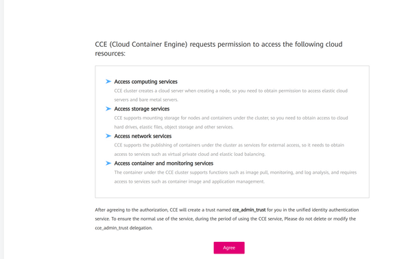

# This is a blueprint to start easy and fast with OTC Terraform

- You will need a dockerconfig_json_base64_encoded which contains the pullsecret informations for the public dockerhub.
- You will need a gitlab or github access token to be able to pull the information from you git repositories.
- Rename the folder /context to your contextname

## Deploy Infrastructure
- Adjust set-env.sh
    - ACCESS_KEY and SECRET_KEY you get from the OTC UI
- Source set-env.sh
- Go to terraform-remote-state-bucket-creation and execute terraform init and apply
   - Add the backend config under ${context}/${stage}/settings.tf
   - Add the backend config under ${context}/${stage}/kubernetes/settings.tf
- Go into the folder ${context}/${stage} (in this example it is showcase/dev)
   - Adjust variables.tf to your needs
   - Add or remove some modules from main.tf if you like
      - Use https://registry.terraform.io/modules/iits-consulting/project-factory/opentelekomcloud/latest
      - Execute Terraform init and apply
        - It will take like 10-15 Minutes till everything is up
      - If it fails most probably you need to activate CCE Access. Go to the OTC UI to the CCE which you created and press agree
        

## Try out if the cluster is available
- execute inside your shell "source ./shell-helper.sh"
- execute inside your shell "getKubectlConfig"
  - Now you should have access to the kubernetes cluster
  - try it out with "kubectl get nodes"
- execute inside your shell "getElbPublicIp"
- execute inside your shell "getElbId"

## Deploy GitOps and ArgoCD
- Go into the folder ${context}/${stage}/kubernetes
- Adjust ${context}/${stage}/kubernetes/main.tf
  - Change argocd_git_access_token_username value to the right value
  - Change argocd_project_source_repo_url to your git repo url
- Execute Terraform init and apply
- Now ArgoCD should boot up successfully

## Access ArgoCD UI

Since you source the shell-helper.sh you should be able to just execute "argo" inside the shell.

It will print out the Username and the Password on the first line and the browser should open automatically.
If not open your browser and open this url: http://localhost:8080/argocd

## The End

Congratulations you set up everything. To deploy some services please switch to the infrastructure project:
https://github.com/iits-consulting/otc-infrastructure-charts-template