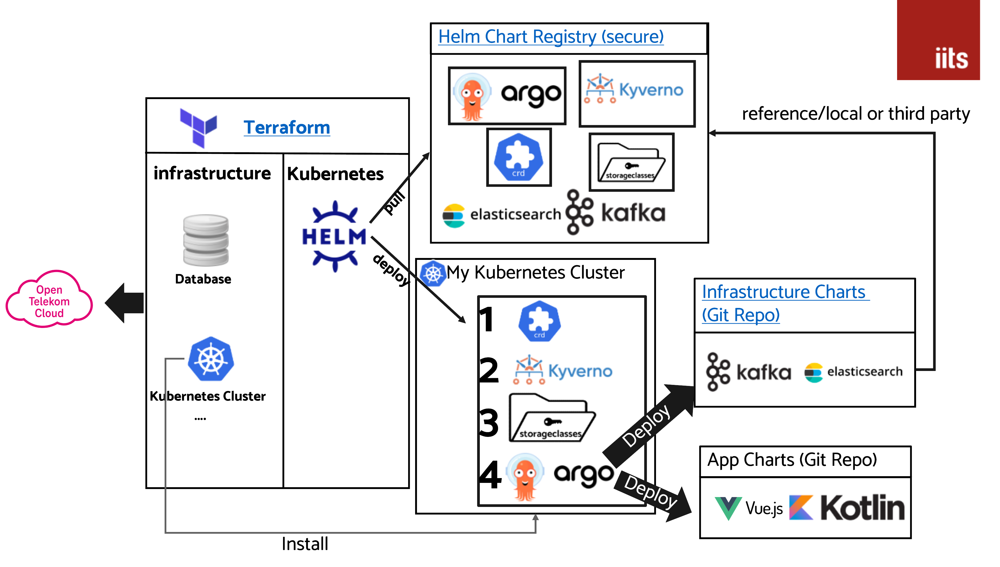
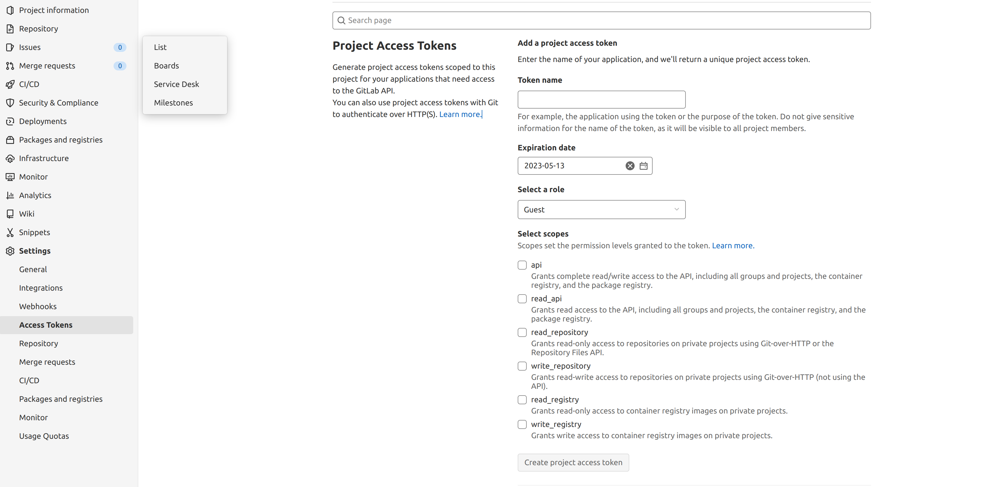
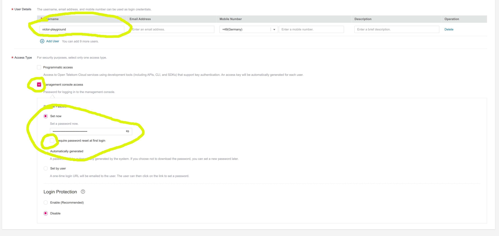

# Blueprint for iits OTC GitOps

## Introduction

During this Workshop/Blueprint you will learn the basics about proper automation of infrastructere and how to bootstrap ArgoCD.
A similar Approach also applies to FluxCD.

Here is what we want to achieve:



**Please keep in mind this workshop just teaches the basics. For a proper and secure production setup please contact us at kontakt@iits-consulting.de**

## Tools Requirements

* Install Terraform in the Version 1.3.5. We would recommend to use the tool [tfenv](https://github.com/tfutils/tfenv)
* Install [otc-auth](https://github.com/iits-consulting/otc-auth). We need to it to be able to login over CLI and getting the kube config
* A proper Shell. If you are using Windows please use GitBash
* [kubectl cli](https://kubernetes.io/de/docs/tasks/tools/install-kubectl)

## Preparation & Requirements
1. Determine your Tenant Identification (for example OTC-EU-DE-0000000000100XXXXXXX)
    * Login into your OTC Tenant
    * On the right top corner you will find the tenant id
2. Choose a unique context name. The context is an identifier to whom this setup belongs for example a department name, customer name ...
   Please don't use spaces or any special characters.
3. Connect a subdomain to OTC
    * Since we want to expose our setup through DNS we need to create a subdomain and connect it to your OTC Project. For that you need to do the following:
      * Create a NS record inside your domain provider for {contextname}.my-domain.de with the following values
        * ns1.open-telekom-cloud.com
        * ns2.open-telekom-cloud.com
4. Docker Account 
   * To avoid the [docker rate limit problem](https://docs.docker.com/docker-hub/download-rate-limit/#:~:text=Docker%20Hub%20limits%20the%20number,pulls%20per%206%20hour%20period) you need to create a docker.io account first or use your existing credentials/token. 
       If you don't have a docker account you can create a free one [here](https://hub.docker.com/signup/)
5. Access token **to your Fork** of the git repository  [otc-infrastructure-charts-template project](https://github.com/iits-consulting/otc-infrastructure-charts-template). It is needed for ArgoCD to be able to pull informations from there
    * Click [here](https://github.com/settings/tokens?type=beta) if you use Github
    * If you use Gitlab you can go to your project and then create a token here:
    * 
      
6. Create a user for this workshop inside your OTC Tenant
    * Login with your account into OTC
    * Go to Identity and Access Management
    * Click "Create User" in the top right corner
    * 
    * Save the password somewhere secure and use this user for the workshop
7. Since we will encrypt all data and disks by default add the "KMS Administrator" role to your project
    * Go to Identity and Access Management
    * Go to Agencies
    * Adjust EVSAccessKMS Agency like this
      * 
8. Adjust the .envrc file. The .envrc is needed to set environment variables which are used by terraform or by the otc-auth cli tool
   * Set your context name under line number 2 (TF_VAR_context)
   * If you are not working under the region eu-de then please change line number 3 (TF_VAR_region)
   * replace all "REPLACE_ME" Placeholder with the correct values
   * source the updated .envrc file like this "source .envrc"


## Create a remote state bucket

First thing we create is a remote OBS/S3 Bucket. Within this bucket we store the current state of the OTC infrastructure which we will create.

1. Go to the folder _terraform-remote-state-bucket-creation_ and execute terraform init and apply
2. The output from terraform should look like this: 
3. Add the remote state configuration under:
    - ./otc-cloud/dev/settings.tf
    - ./otc-cloud/dev/kubernetes/settings.tf

## Create the kubernetes cluster and other infrastructure components
1. Go into the folder otc-cloud/dev
    - Take a look at the main.tf and try to understand what we want to set up
    - (Optional) Add or remove some modules from main.tf if you like
        - Use https://registry.terraform.io/modules/iits-consulting/project-factory/opentelekomcloud/latest
   - Execute Terraform init and apply
       - It will take like 10-15 Minutes till everything is up
   - If it fails most probably you need to activate CCE Access. Go to the OTC UI to the CCE which you created and press agree
          
      

## Validate your setup is up and running
  * Check Kubernetes
    * source the file otc-cloud/dev/stage-dependent-env.sh
    * the output should look like this:
    * execute inside your cli the following command:
      ```shell
      kubectl get nodes
      ```
  * Check DNS
    * execute inside your cli the following command:
    ```shell
    nslookup $TF_VAR_domain_name 
    ```
    * It should point to some 80.*.*.* Address

Congrats your infrastructure is working properly

## Bootstrap ArgoCD

Now we want to bring some life into our cluster. 
For that we will deploy everything from our Fork from the _Preparation & Requirements Step 5_

- Go into the folder ./otc-cloud/dev/kubernetes
- Take a look at the _main.tf_ and try to understand what we want to achieve
- Execute Terraform init and apply
- ArgoCD should slowly start to boot and after around 3-4 Minutes it should be finished


## Access ArgoCD UI

First we will access ArgoCD over a kubectl port-forward. To do that execute the following commands in your cli:

```shell
# This command will make the argo command available
source shell-helper.sh
# Opens a tunnel to your kubernetes cluster and exposes ArgoCD under http://localhost:8080/argocd
# It will print out the Username and the Password on the first line and the browser should open automatically.
argo
```

## Go over to Argo and deploy some services

We are finished with the terraform part and will switch now over to this repository: https://github.com/iits-consulting/otc-infrastructure-charts-template
