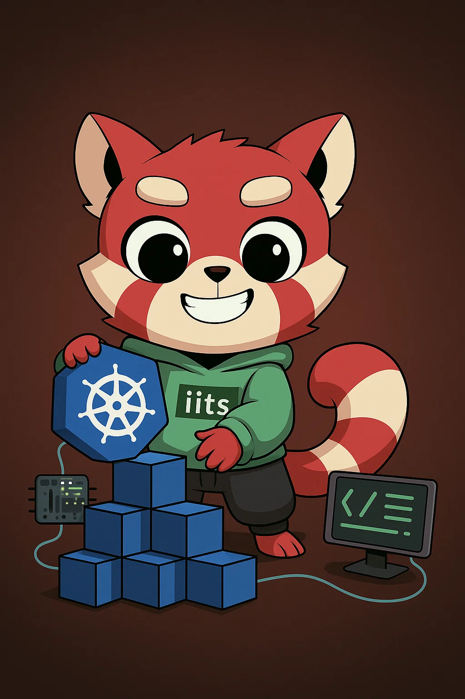
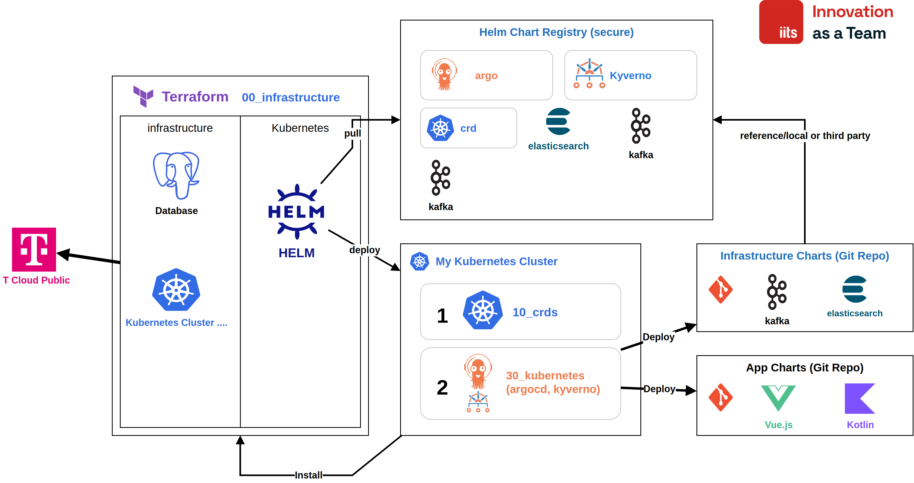
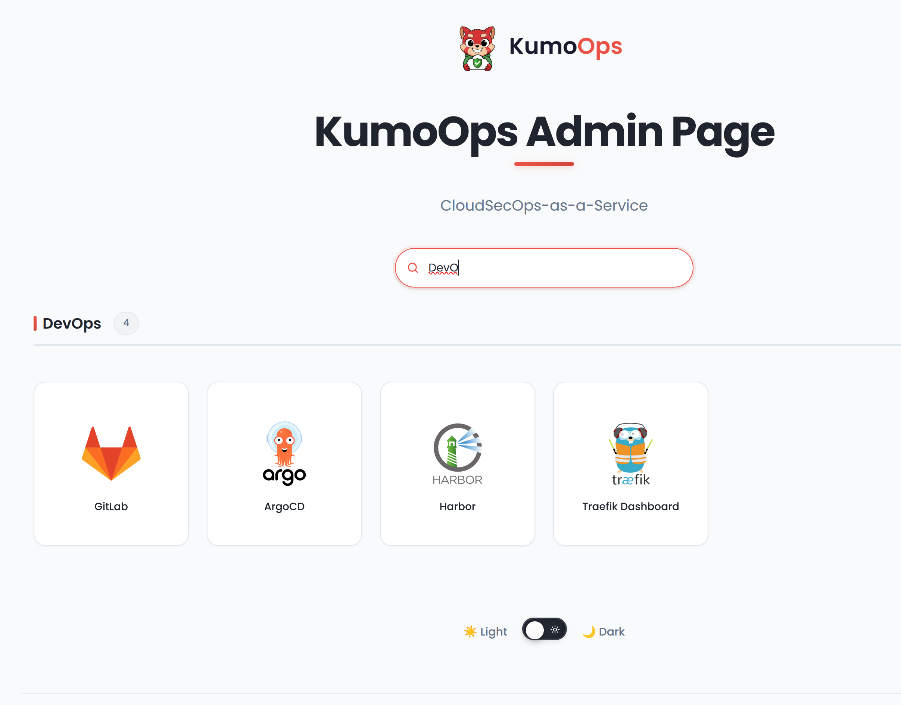
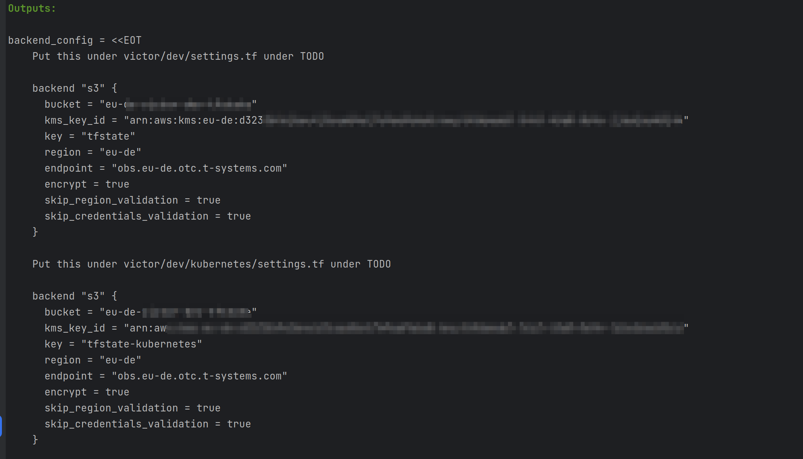
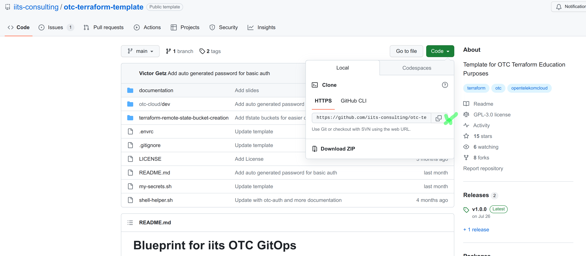
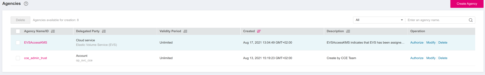

# Blueprint for iits OTC GitOps

<table>
<tr>
<td width="170" valign="top">

</td>
<td valign="top">

You build a CCE Kubernetes cluster on OTC with OpenTofu, and then ArgoCD takes over and
deploys the applications from your own Git repository. The same approach also works with
FluxCD.

OpenTofu sets up the cluster platform (Traefik, cert-manager, Kyverno, storage classes,
ArgoCD). ArgoCD deploys everything on top of it from your charts repository.

**Plan about 45 minutes**, most of it waiting for the cluster to come up.

</td>
</tr>
</table>

> [!IMPORTANT]
> This workshop just teaches the basics. For a proper and secure production setup
> please contact us at kontakt@iits-consulting.de

## Contents

1. [What we want to achieve](#1-what-we-want-to-achieve)
   - [How this repository is laid out](#how-this-repository-is-laid-out)
2. [Preparation](#2-preparation)
3. [Create the OpenTofu state bucket](#3-create-the-opentofu-state-bucket)
4. [Create the infrastructure](#4-create-the-infrastructure)
5. [Validate your setup](#5-validate-your-setup)
6. [Configure the cluster and bootstrap ArgoCD](#6-configure-the-cluster-and-bootstrap-argocd)
7. [Access the ArgoCD UI](#7-access-the-argocd-ui)
8. [Go over to Argo and deploy some services](#8-go-over-to-argo-and-deploy-some-services)
- [Appendix A: run it without KASM](#appendix-a-run-it-without-kasm)
- [Appendix B: do the workshop on your own tenant](#appendix-b-do-the-workshop-on-your-own-tenant)

---

## 1. What we want to achieve



The deployed admin dashboard is the entry point to all services:



ArgoCD deploys the following services from your charts repository:

| Service | What it is |
| --- | --- |
| Admin Dashboard | Entry point to the deployed services |
| Basic Auth Gateway | Protects the exposed services |
| Elastic Stack | kibana, elasticsearch, filebeat |

---

## How this repository is laid out

You run `tofu apply` three times, in three different folders, always in this order:

| Folder | What it creates | Section |
| --- | --- | --- |
| `stages/dev/` | The OBS bucket that stores the OpenTofu state | [3](#3-create-the-opentofu-state-bucket) |
| `stages/dev/00_infra` | VPC, SNAT, load balancer, CCE cluster, DNS zones | [4](#4-create-the-infrastructure) |
| `stages/dev/20_configuration` | Traefik, cert-manager, Kyverno, storage classes, ArgoCD | [6](#6-configure-the-cluster-and-bootstrap-argocd) |

---

## 2. Preparation

### 2.1 Create your charts repository

ArgoCD later deploys everything from this repository, so it has to be yours.
Go to https://github.com/iits-consulting/otc-infrastructure-charts-template and

- click on _Use this template_
- click on _Create a new repository_
  - choose a repository name
  - select _Private_ repository

### 2.2 Create a GitHub access token

ArgoCD needs it to pull from the repository you just created.
Create it [here](https://github.com/settings/tokens?type=beta):

- select _Only select repositories_ and choose your charts repository
- permissions:
  - Contents: Read-Only
  - Commit Status: Read-Only

### 2.3 Get your credentials sheet

You received a credentials sheet from us. The key names match the variables in `.envrc`
and `secrets.sh` exactly, so you can copy the values over one by one.

`<context>` is your business context, for example your company or department name. It
shows up in the OTC project name and in your workshop domain.

```yaml
eu-de_<context>:
  <username>:
    TF_VAR_context: <context>
    TF_VAR_domain_name: <context>.tcp-workshop.iits.tech
    TF_VAR_email: <context>@kumo-ops.com
    OS_PROJECT_NAME: eu-de_<context>
    OS_DOMAIN_NAME: OTC000000000010000XXXXX
    OS_USERNAME: <username>
    OS_PASSWORD: <password>
    TF_VAR_otc_user_id: <32 hex chars>
    TF_VAR_dockerhub_username: <docker hub user>
    TF_VAR_dockerhub_password: <docker hub token>
    kasm_url: ...          # only if you use KASM
    cendo_url: ...         # workshop room
```

### 2.4 Adjust `.envrc` and `secrets.sh`

The `.envrc` sets the environment variables used by OpenTofu and by the otc-auth CLI.

- replace all `REPLACE_ME` placeholders with the values from your credentials sheet
- set `TF_VAR_argocd_repo_url` to your charts repository from step 2.1
- source the updated file:

  ```shell
  source .envrc
  ```

  It validates your values via `check-setup.sh` and stops with a list of problems
  if anything is missing or malformed.

---

## 3. Create the OpenTofu state bucket

OpenTofu needs a safe place for its state file. Create an OBS/S3 bucket for it first, then
point every stage at that bucket.

1. Go into the folder `stages/dev/`
2. Run (takes less than a minute):

   ```shell
   tofu init
   tofu apply
   ```

3. Wait for completion. The output should look like this:

   

4. The output prints a ready-to-use `backend "s3"` block and lists every stage
   `settings.tf` file it belongs in. Copy that block into the section marked with
   `TODO Add backend config S3 here` in each stage's `settings.tf`
   (`00_infra/settings.tf` and `20_configuration/settings.tf`).

---

## 4. Create the infrastructure

1. Switch into the folder `stages/dev/00_infra`
2. Read `cluster.tf`, `network.tf` and `dns.tf` to see what gets created (the VPC, SNAT,
   public load balancer, CCE cluster with node pools, and the public/private DNS zones)
3. The sizing and versions live in `_infra.auto.tfvars` (cluster version, node flavor,
   availability zones, CIDRs). Adjust them if you like. See the available modules under
   https://registry.terraform.io/namespaces/iits-consulting
4. Run:

   ```shell
   tofu init
   tofu apply
   ```

> [!NOTE]
> The cluster needs up to 15 minutes to come up. Do not cancel the running apply.

---

## 5. Validate your setup

**Check Kubernetes.** OpenTofu already fetched the kube config for you:

```shell
kubectl get nodes
```

**Check DNS.** It should point to an address similar to `80.*.*.*`:

```shell
nslookup $TF_VAR_domain_name
```

Congrats, your infrastructure is working properly!

---

## 6. Configure the cluster and bootstrap ArgoCD

Now bring some life into the cluster. The `20_configuration` stage bootstraps
the cluster platform and then deploys ArgoCD, which takes over everything from the charts
repository you created in step 2.1.

Go into the folder `./stages/dev/20_configuration`. These are the `.tf` files and what
they deploy:

| File | What it deploys |
| --- | --- |
| `crds.tf` | The CRDs (cert-manager, Kyverno, Prometheus stack) needed before the corresponding controllers and ArgoCD applications can run |
| `kyverno.tf` | Kyverno (policy engine and image pull secret injection) |
| `traefik.tf` | The Traefik ingress controller wired to the public load balancer |
| `cert-manager.tf` | cert-manager with the OTC DNS cluster issuer for Let's Encrypt certificates |
| `cce_storage_classes.tf` | The CCE storage classes with a KMS-encrypted default |
| `argo.tf` | ArgoCD and the ArgoCD apps that point at your charts repository |

Then run:

```shell
tofu init
tofu apply
```

ArgoCD starts booting and is finished after around 3 to 4 minutes.

---

## 7. Access the ArgoCD UI

Open ArgoCD through a kubectl port-forward:

```shell
# This command will make the argo command available (not necessary if you use KASM)
source shell-helper.sh
# Opens a tunnel to your kubernetes cluster and exposes ArgoCD under http://localhost:8080/argocd
# It will print out the Username and the Password on the first line and the browser should open automatically.
argo
```

Log in with the user `admin` and your `TF_VAR_admin_website_password`, the same password
as the admin dashboard.

After some minutes ArgoCD is also available over your domain:
`https://admin.${TF_VAR_domain_name}/argocd`

---

## 8. Go over to Argo and deploy some services

The OpenTofu part is done. Continue in this repository:
https://github.com/iits-consulting/otc-infrastructure-charts-template

---

## Appendix A: run it without KASM

Most workshops run on our KASM setup, where everything below is already prepared.
Only if you work on your own machine you need these tools and the repository clone.

### Tools

| Tool | Notes |
| --- | --- |
| [OpenTofu](https://opentofu.org) **1.10.2** | Use [tenv](https://github.com/tofuutils/tenv) to manage versions |
| [otc-auth](https://github.com/iits-consulting/otc-auth) | CLI login and kube config |
| [kubectl](https://kubernetes.io/de/docs/tasks/tools/install-kubectl) | Kubernetes CLI |
| A bash shell | On Windows use GitBash |
| git | |
| GitHub account | |

### Clone this repository

Go to https://github.com/iits-consulting/otc-terraform-template, click on _Code_
and clone the repository.



---

## Appendix B: do the workshop on your own tenant

If you want to do the workshop on your tenant you need to create a user first and
configure the IAM:

1. Login into the OTC UI
2. Go to _IAM_
3. Create a new project for the workshop
4. Create a user and assign it the admin role (you will need the username and password)
5. Go to _Agencies_

   

6. For _EVSAccessKMS_ click on _Authorize_ and add _KMS Administrator_ for _All resources_
7. For _cce_admin_trust_ click on _Authorize_ and add _Tenant Administrator (Exclude IAM)_
   for _All resources_
